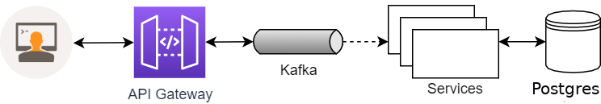

## API Gateway com NestJS e Apache Kafka

<p align="center">


<p align="center">


  
##  Descrição
API Gateway construída com framework [Nestjs](https://nestjs.com), [Apache Kafka](https://kafka.apache.org/), [Swagger](https://swagger.io/), [Docker Compose](https://docs.docker.com/compose/).

## Arquitetura

  

## Instalação API Gateway

```bash
# Instalação das dependências
$ yarn

# Iniciar containers com kafka e zookeeper
$ yarn kafka:up

# Remover containers
$ yarn kafka:down

```

## Swagger

```url
http://localhost:3000/docs
```

## **💥 Considerações**

Existem muitas vantagens na utilização do NestJs para criação de microserviços pelo fato dele ser simples de usar e também por respeitar os principios do <strong>SOLID</strong>. 

## **👨‍🚀 Autor**

<a href="https://github.com/tpaphysics">

  <br />
  <sub>
    <b>Thiago Pacheco de Andrade</b>
  </sub>
</a>
<br />
  
👋 Meus contatos!
  
[](https://www.linkedin.com/in/thiago-pacheco-200a1a86/)
[](mailto:physics.posgrad.@gmail.com)
  
##  Licença
  
  
Veja o arquivo [MIT license](LICENSE ).
